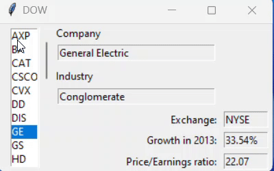
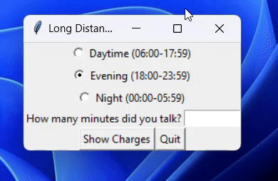
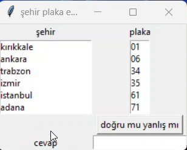

# DOW - Displaying DOW Jones Industrial Average Information

This program displays information about companies listed in the DOW Jones Industrial Average. 
Users can select a company from the list, and details about the selected company such as industry, exchange, growth rate, and price/earnings ratio will be displayed.



## Usage

1. **Download the project files:**
   - Download the `DOW.py` file and `DOW.txt` file from the repository.

2. **Run the program:**
   - Open the terminal or command prompt.
   - Navigate to the directory where the `DOW.py` file is located.
   - Run the command: `python DOW.py`
   
3. **View Company Information:**
   - Upon running the program, a window will appear displaying a list of company symbols in the DOW Jones Industrial Average.
   - Select a company from the list to view detailed information about that company including its industry, exchange, growth rate in 2013, and price/earnings ratio.

4. **Exit the Program:**
   - To exit the program, simply close the window.

## Requirements
- Python 3.x
- tkinter (Tkinter library for Python)

## Data Source
- The program reads company information from the `DOW.txt` file, which should be present in the same directory as the `DOW.py` file.

Enjoy exploring DOW Jones Industrial Average companies!

<br>
<hr>
<hr>
<hr>
<hr>
<br>
<br>

# Long Distance Call Calculator

A simple GUI application to calculate the charges for long distance calls based on different time periods.

## Features

- Three time period options: Daytime, Evening, and Night.
- User input for the number of minutes for the call.
- Calculation of total charges based on the selected time period and minutes.



## Usage

1. Select the time period of the call using the radio buttons:
   - Daytime (06:00-17:59)
   - Evening (18:00-23:59)
   - Night (00:00-05:59)

2. Enter the number of minutes for the call in the provided entry field.

3. Click the "Show Charges" button to calculate the total charges.

4. The calculated total charges will be displayed in a message box.

## How to Run

To run the application, execute the Python script `LongDistanceGUI.py` using a Python interpreter.

```bash
python LongDistanceGUI.py
```

<br>
<hr>
<hr>
<hr>
<hr>
<br>
<br>

# City-Plate Matching with tkinter

This simple program allows you to match city names with their respective license plate numbers.



## How to Use

1. Run the program.
2. Select a city from the list on the left.
3. Select the corresponding license plate number from the list on the right.
4. Click the "Check" button to verify your selection.
5. The result (correct or incorrect) will be displayed below.

## Interface

- The left list contains the names of cities.
- The right list contains the license plate numbers.
- The "Check" button verifies if the selected city matches the corresponding license plate number.
- The result is displayed in the entry field labeled "Answer".

## City-Plate Pairs

- **Cities:**
  - Kırıkkale
  - Ankara
  - Trabzon
  - Izmir
  - Istanbul
  - Adana

- **License Plate Numbers:**
  - 71
  - 06
  - 61
  - 35
  - 34
  - 01

Enjoy matching city names with license plate numbers!

## Author
- [Eraycan Sivri]
